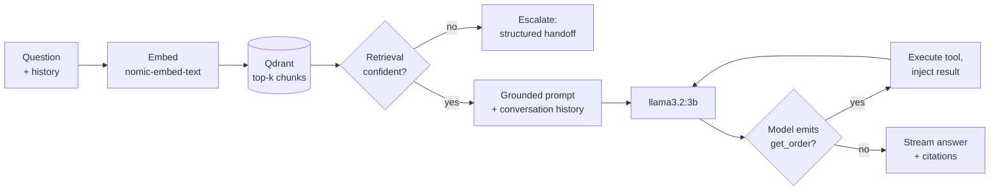

# SupportPilot

**An AI customer-support assistant that answers from a company's own documents —
with citations, live order lookups, and a refusal to guess.**

Ask it a policy question and it retrieves the relevant chunks from the ingested
docs, grounds a local LLM in them, and streams the answer token-by-token with
clickable sources. Ask it about an order and it calls a live API. Ask it
something the documents don't cover and it hands off to a human instead of
making something up.

Runs **fully local and free** — no API keys, no billing. Generation and
embeddings come from [Ollama](https://ollama.com); the vector store is
[Qdrant](https://qdrant.tech) in Docker.

## Three questions, three behaviours

Every question takes one of three paths through the system. These are the actual
responses, reproducible against the seeded knowledge base:

1. **"How long do refunds take?"** — the answer streams in and cites the exact
   source document and page. Clicking `[1]` highlights the chunk it came from,
   with its retrieval score.
2. **"Where is order 1042?"** — the ship date and tracking number aren't in any
   document. The model calls the `get_order` tool, the backend executes it and
   feeds the result back, and the answer combines that live data with the docs'
   guidance on how to track a package.
3. **"Can I set up a monthly payment plan?"** — the documents don't cover this.
   Rather than guess, the system escalates: a structured handoff summary showing
   the retrieval score that triggered it (0.44, under the 0.5 threshold), routed
   to the Billing team.

## How it works



"Confident?" is a threshold on the top chunk's cosine score (0.5). Below it, the
knowledge base can't answer, so guessing is the wrong behaviour — the request
becomes a human handoff instead.

One simplification the diagram leaves out: the `get_order` tool is only *offered*
to the model when a cheap keyword check thinks the question concerns an order. A
3B model handed a tool on every turn will try to call it on refund-policy
questions too. A larger model wouldn't need the guard.

## Built without an LLM framework

The backend has **one NuGet dependency** — PdfPig, for extracting text from PDFs.
Embeddings, SSE streaming, vector search, and the function-calling loop are
implemented directly against Ollama's HTTP API.

That was the point. The tool loop — *describe the function as JSON Schema → the
model emits a call → you execute it → you inject the result → you re-prompt* — is
the thing worth understanding, and a framework hides it behind one method call.

## Does it actually work?

"It works when I try it" isn't evidence. `scripts/eval.ps1` runs a fixed set of
questions with known answers (`docs/eval/testset.json`) through `/chat` and scores:

- **Correctness** — does the answer contain the known facts? For questions the
  docs *can't* answer, "correct" means the system **refuses to fabricate** —
  either escalating to a human or saying "I don't know."
- **Groundedness** — an answered question must cite a source; an unanswerable one
  must refuse. Either way it may not make something up.

Latest run (16 cases, `llama3.2:3b`, generation temperature pinned to **0** for
reproducible scores — full table in [docs/eval/results.md](docs/eval/results.md)):

| Metric | Score |
|---|---|
| **Correctness** | **15 / 16 (93.8%)** |
| **Groundedness** | **16 / 16 (100%)** |

All 3 unanswerable questions refuse correctly (no hallucinations). The one miss is
instructive: *"How long do international orders take to arrive?"* is refused even
though the fact sits in the **rank-1 retrieved chunk** (score 0.65) — the same fact
is answered when phrased *"international shipping"*. So the failure is in
**generation, not retrieval**: the 3B model is brittle to phrasing. That points at
the planned fixes — query rewriting (Day 16) and/or a larger generation model —
rather than anything in the retrieval layer.

## Stack

| Layer | Choice |
|---|---|
| Backend | ASP.NET Core (.NET 10) minimal API |
| Generation | Ollama `llama3.2:3b` (raw `HttpClient`, streamed) |
| Embeddings | Ollama `nomic-embed-text` (768-dim, cosine) |
| Vector DB | Qdrant (Docker) |
| Frontend | React + Vite (SSE streaming, clickable citations) |
| PDF extraction | PdfPig (MIT) |

## Prerequisites

- [.NET 10 SDK](https://dotnet.microsoft.com/)
- [Docker](https://www.docker.com/) (for Qdrant)
- [Ollama](https://ollama.com/), with the two models pulled:
  ```bash
  ollama pull llama3.2:3b
  ollama pull nomic-embed-text
  ```
- Node.js (for the frontend)

## Run it with Docker (one command)

The whole app — Qdrant, backend, and the nginx-served frontend — comes up with a
single command. Generation + embeddings still come from **Ollama on the host**
(on your GPU), which the backend reaches via `host.docker.internal`, so the only
prerequisite outside compose is a running Ollama with the two models pulled.

```bash
ollama serve                       # if it isn't already running as a service
docker compose up --build          # qdrant + backend(:5254) + frontend(:8080)
pwsh ./scripts/seed-docs.ps1       # seed the demo knowledge base
```

Open **http://localhost:8080** and ask away.

## Run it (local dev)

For hot-reload while developing, run the pieces directly instead:

```bash
# 1. Vector DB
docker run -d --name qdrant -p 6333:6333 qdrant/qdrant

# 2. Local models (Ollama usually runs as a service; otherwise:)
ollama serve

# 3. Backend  ->  http://localhost:5254
cd backend/SupportPilot.Api
dotnet run

# 4. Seed the demo knowledge base from sample-docs/ (idempotent)
pwsh ./scripts/seed-docs.ps1

# 5. Frontend  ->  http://localhost:5173
cd frontend
npm install
npm run dev
```

Open http://localhost:5173 and ask away. Sample questions against the seeded
"Acme Gadgets" docs:

- *"How long do refunds take?"* → cites the support policy
- *"How do I pair the SoundPods Pro?"* → cites the product manual
- *"How much do the SoundPods Pro cost?"* → cites the catalog
- *"Who is the CEO of Acme Gadgets?"* → *"I don't know based on the available documents."*

## Evaluation

```bash
pwsh ./scripts/eval.ps1        # backend running + docs seeded; writes docs/eval/results.md
```

## Repository layout

```
backend/SupportPilot.Api/   ASP.NET Core API (RAG loop, ingestion, vector store) + Dockerfile
frontend/                   React + Vite chat UI + Dockerfile + nginx.conf (prod proxy)
docker-compose.yml          One-command local stack (qdrant + backend + frontend)
.github/workflows/ci.yml    CI: build backend, frontend, and both Docker images
sample-docs/                Seed corpus (the fictional "Acme Gadgets" company)
scripts/seed-docs.ps1       Rebuild the knowledge base from sample-docs/
scripts/eval.ps1            Run the evaluation set and score correctness/groundedness
docs/eval/                  Evaluation test set (testset.json) + latest results.md
docs/deploy/azure.md        Azure Container Apps deploy runbook
docs/revision/              Per-day interview-revision notes (day-01 … day-14)
CLAUDE.md                   Project plan and 3-week roadmap
```

## Endpoints

| Method | Route | Purpose |
|---|---|---|
| `GET` | `/chat?q=…` | RAG answer, streamed as SSE, with citations |
| `POST` | `/chat` | Same, but takes the full conversation history (multi-turn) |
| `POST` | `/ingest` | Upload a `.pdf/.txt/.md` → extract, chunk, embed, store |
| `GET` | `/search?q=…` | Raw retrieval results (debug view of the "retrieve" half) |
| `GET` | `/orders/{id}` | Mock Orders API — the live data the `get_order` tool reads |

---

Built as a 3-week learning project — see [CLAUDE.md](CLAUDE.md) for the roadmap
and [docs/revision/](docs/revision/) for per-day write-ups.
