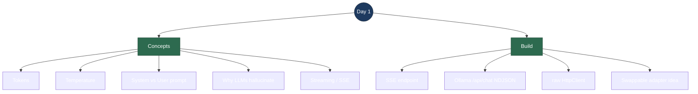

# Day 1 — Interview Revision: LLM Basics + Streaming Chat Endpoint

> **What Day 1 delivered:** a minimal ASP.NET Core endpoint (`GET /chat`) that streams an LLM answer token-by-token over Server-Sent Events, talking to a **local Ollama** server running `llama3.2:3b` — no API key, no billing.
>
> **Run it:** `dotnet run` in `backend/SupportPilot.Api`, then open `http://localhost:5254/chat?q=What+is+your+refund+policy`

---

## Topic map



---

## Concept Q&A

**What is a token?**
The unit an LLM reads and writes — roughly a word-piece (~4 chars of English, so ~¾ of a word). The model doesn't see characters or whole words; it predicts the next token from the previous ones. You pay per token (input + output) on hosted APIs, and every model has a context-window limit measured in tokens.

**What does `temperature` do?**
It controls randomness in next-token selection. `0` ≈ deterministic (always the highest-probability token — good for factual/support answers); higher values (0.7–1.0) flatten the probabilities so output is more varied/creative. For a support assistant you want it **low** so answers are consistent and grounded.

**System prompt vs user prompt?**
The **system** prompt sets the assistant's role and standing rules ("You are SupportPilot… if unsure, say so") and applies to *every* turn. The **user** prompt is the actual question. Keeping them separate is what lets you enforce behavior (tone, guardrails) independently of whatever the user types.

**Why do LLMs hallucinate?**
An LLM is a next-token predictor trained to produce *plausible* text, not *true* text. It has **no access to your private/company data** and no built-in "I don't know" reflex, so when asked something outside its training it confidently fills the gap. Day 1's refund-policy test showed this directly — the model hedged because it genuinely doesn't know your policy. **That gap is what RAG fixes** (Days 2–4).

**What is streaming, and why SSE?**
Streaming sends the answer **token-by-token as it's generated** instead of waiting for the whole response. It makes the UI feel instant (first token in ~ms, not seconds). **Server-Sent Events (SSE)** is a one-way server→client stream over plain HTTP (`Content-Type: text/event-stream`, each message is `data: ...\n\n`). It's simpler than WebSockets and perfect here because the data only flows one direction.

**Why local Ollama instead of a paid API?**
Ollama runs open models (`llama3.2:3b`) **on your own machine** — free, no key, no rate limits, works offline. For learning it's ideal: you see every byte of the request/response. The architecture stays identical to a hosted API (same request/stream shape), so it's a drop-in swap — see Talking Points.

---

## Code walkthrough

The whole endpoint lives in `backend/SupportPilot.Api/Program.cs`. Trace it top to bottom:

| Lines | What it does | Why it matters |
|---|---|---|
| 12–17 | Register a **named `HttpClient`** (`"ollama"`) pointing at `http://localhost:11434`, with **`Timeout.InfiniteTimeSpan`** | A streamed response stays open for seconds — the default 100s timeout would kill it. `IHttpClientFactory` handles socket reuse. |
| 24 | `const GenerationModel = "llama3.2:3b"` | Changing the model is a **one-line edit** — the "swappable adapter" in practice. |
| 28–30 | The **system prompt** ("…if unsure, say so rather than guessing") | Frames behavior for every request; separate from the user's `q`. |
| 46–47 | Set `Content-Type: text/event-stream` + `Cache-Control: no-cache` | Declares an SSE stream so the browser reads it incrementally. |
| 51–58 | Build `OllamaChatRequest` with `Stream: true` and `[system, user]` messages | `stream:true` tells Ollama to emit the answer **incrementally** as NDJSON. |
| 71–72 | `SendAsync(..., HttpCompletionOption.ResponseHeadersRead, ct)` | **The key streaming line** — start reading as soon as headers arrive instead of buffering the full body. |
| 87–99 | Read the response **line-by-line** (`ReadLineAsync`); each line is one JSON object `{"message":{"content":"…"},"done":false}`; forward `message.content`; stop when `done == true` | This is how you consume Ollama's **NDJSON** stream — one JSON object per line, not one big JSON blob. |
| 114–118 | `WriteEvent` → writes `data: {text}\n\n` then **`FlushAsync`** | The flush is essential — without it the server buffers and the client sees nothing until the end (defeating streaming). |
| 101–106 | `catch (HttpRequestException)` → emits a clean `[error]` message | Most common cause: Ollama isn't running. Surfaces it instead of a 500 crash. |
| 108 | Always send `[DONE]` sentinel at the end | Lets the client know the stream is complete. |
| 122–133 | `record` types (`OllamaChatRequest`, `OllamaMessage`, `OllamaChatChunk`) with `[JsonPropertyName]` | Map C# PascalCase ↔ Ollama's lowercase JSON. Records go **after** top-level statements. |

**One-sentence flow to recite:** *browser hits `GET /chat?q=…` → we POST to Ollama's `/api/chat` with `stream:true` → read the NDJSON stream line-by-line → relay each content chunk to the browser as an SSE `data:` event, flushing after each → finish with `[DONE]`.*

---

## Talking points

- **"Generation is a swappable adapter."** Pivoting from the Anthropic SDK to local Ollama touched **~40 lines in one file** (`Program.cs`). Retrieval, grounding, streaming, and citations are all provider-agnostic and didn't change. This is the strongest architecture soundbite from Day 1 — it shows you designed a clean seam, not a vendor lock-in.

- **Running open models locally is a stronger full-stack/infra signal** than calling a paid API — you understand the whole request/response/stream loop, not just an SDK method.

- **Day 1 exposes the exact gap RAG fixes.** The model can answer general questions but *not* company-specific ones (refund policy) — it honestly hedged because it has no access to that knowledge. That's the motivation for Days 2–4: **embed** your docs → **retrieve** the relevant chunks → **ground** the answer in them → **cite** the source.

- **Why streaming matters for UX:** first token in milliseconds makes a support bot feel responsive; a 5-second blank wait feels broken even if total time is the same.

---

## Reproduce-it cheatsheet

```bash
# 1. Confirm both local models are present
ollama list          # expect: llama3.2:3b  and  nomic-embed-text

# 2. Make sure the Ollama server is up (it runs as a tray service on login)
#    Test generation directly:
ollama run llama3.2:3b "Say hi in three words"

# 3. Run the API
cd backend/SupportPilot.Api
dotnet run

# 4. Hit the streaming endpoint (browser or curl)
#    Browser: http://localhost:5254/chat?q=Say+hi+in+exactly+three+words
curl -N "http://localhost:5254/chat?q=Say+hi+in+exactly+three+words"
#    -N disables curl buffering so you SEE the tokens stream in
```

**Expected:** tokens arrive one SSE `data:` line at a time, ending with `data: [DONE]`. Ask a company-specific question ("what's your refund policy?") and watch the model hedge — that's the RAG cliffhanger for Day 2.
