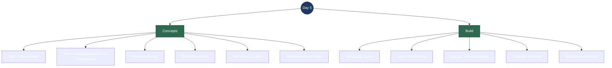

# Day 5 — Interview Revision: The React Chat Frontend (Consuming an SSE Stream)

> **What Day 5 delivered:** the face of the product. A React (Vite) chat UI that **streams** the grounded answer token-by-token, lets you **upload** a document to the ingestion pipeline, and renders **clickable citations**. The only genuinely new skill is one thing — *how a browser consumes a Server-Sent Events stream* — so that's where the depth is.
>
> **Run it:** backend on `:5254` (with Ollama + Qdrant up and a doc ingested), then `cd frontend && npm run dev` → open http://localhost:5173.

---

## Topic map



---

## Concept Q&A

**How does a browser consume a token-by-token SSE stream?**
The backend sends `Content-Type: text/event-stream` and writes frames of the form `data: <payload>\n\n`, flushing after each. On the client we open the request with `fetch()`, take `response.body.getReader()` (a `ReadableStream` reader), and loop `reader.read()` to pull raw byte chunks. A `TextDecoder` turns bytes into text; we split on the blank-line frame separator (`\n\n`) and act on each complete frame. Tokens get appended to the UI as they arrive — that's the "typing" effect.

**Why `fetch` + a stream reader instead of the built-in `EventSource`?** *(the key Day 5 interview point)*
`EventSource` is the "official" SSE API but it has two dealbreakers here: (1) it **auto-reconnects** whenever the server closes the connection — after our `[DONE]` it would silently re-fire the whole question again; (2) it only understands plain `data:` events and gives no clean handle to **cancel** an in-flight response. The `fetch` + reader approach costs a few more lines but gives full control: we stop exactly when we see `[DONE]`, parse our own `[CITATIONS]` sentinel, and cancel via `AbortController`. "Why not EventSource?" is a great question to have a crisp answer to.

**Why buffer the bytes — why not act on each chunk directly?**
The network can split a frame **anywhere** — you might receive `data: ref` in one chunk and `unds are\n\n` in the next. So we append every chunk to a `buffer` string, `split('\n\n')`, process all the *complete* frames, and keep the **last** (possibly partial) piece in the buffer for the next read. Skipping this gives you corrupted, half-parsed tokens under real network timing.

**What's the sentinel protocol between backend and frontend?**
Most frames are answer tokens. Three payloads are special: `[DONE]` (stream finished — stop reading), `[CITATIONS]<json>` (the sources, sent once after the answer), and `[error] <message>` (backend failure). Using in-band sentinels over the same `data:` channel keeps the transport dead-simple (no second endpoint, no websockets) — the frontend just checks the payload prefix.

**How did you handle CORS between the React dev server and the API?**
The Vite dev server (`:5173`) and the .NET API (`:5254`) are different origins, so a raw browser `fetch` would need CORS. Instead of adding CORS to the backend, I configured a **Vite dev proxy**: the browser calls `/chat`, `/ingest`, `/search` on its *own* origin and Vite forwards them to `:5254`. No preflight, no backend changes. In production the app is served behind a single origin, so the concern disappears entirely. (Alternative answer: add an ASP.NET CORS policy — valid, but the proxy keeps the frontend self-contained in dev.)

**How do streaming tokens update React state without re-rendering everything?**
Each answer is one message object in a `messages` array. When a token arrives I update **only the last message** with a functional `setState` (`patchLast`) — append the token to its `text`. React re-renders just that bubble. The empty assistant message is pushed *before* the stream starts, so there's a bubble (with a blinking cursor) to fill.

---

## Code walkthrough

Three files carry Day 5 (all under `frontend/`):

**`vite.config.js`** — the dev proxy
```js
server: { proxy: { '/chat': 'http://localhost:5254',
                   '/ingest': 'http://localhost:5254',
                   '/search': 'http://localhost:5254' } }
```
Browser → `:5173/chat` → Vite forwards → `:5254/chat`. Same-origin from the browser's view, so no CORS.

**`src/api.js`** — the streaming consumer (the meat)
- `streamChat(question, {onToken, onCitations, onDone, onError, signal})`:
  `fetch('/chat?q=…', {signal})` → `response.body.getReader()` → loop `read()`.
  Accumulate bytes in `buffer`, `split('\n\n')`, `buffer = frames.pop()` (keep the partial tail).
  For each frame: strip `data:` + one optional leading space (SSE rule — preserves the token's own space), then branch on `[DONE]` / `[CITATIONS]` / `[error]` / else-it's-a-token.
- `ingestDocument(file)`: `FormData` → `POST /ingest` → returns `{file, pages, chunks, collection}`.

**`src/App.jsx`** — UI + streaming state
- State: `messages[]` (`{role, text, citations}`), `input`, `isStreaming`, `upload`.
- `handleAsk`: push the user message **and an empty assistant message**, then call `streamChat`; `patchLast` appends each token / sets citations on that last message.
- `handleStop`: `abortRef.current.abort()` — the `AbortController` cancels the fetch mid-stream.
- `AnswerText`: splits the answer on `/(\[\d+\])/` and renders each `[n]` as a **button** that highlights the matching source in the footnote `<ol className="citations">`.

**One-sentence flow to recite:** *`fetch` the SSE endpoint, read the response body as a stream, buffer bytes and split on blank lines into frames, treat `[DONE]`/`[CITATIONS]`/`[error]` as control signals and everything else as a token appended to the last chat bubble — with a Vite proxy sidestepping CORS and an `AbortController` powering the Stop button.*

---

## Talking points

- **"Why not just use EventSource?"** — Have this answer ready. Auto-reconnect would re-fire the query after the stream closes; and it's clumsy with custom sentinels and cancellation. `fetch` + `ReadableStream` is the deliberate, controllable choice. This single question separates "followed a tutorial" from "understood the transport."

- **Frame buffering is the non-obvious correctness bug.** Naively acting per network chunk corrupts tokens because chunks don't align to frame boundaries. Being able to explain *why* you buffer-and-split shows you've actually run it under real conditions, not just on localhost happy-path.

- **The dev proxy is a clean CORS story.** I kept the backend untouched and moved the cross-origin concern into Vite config — and I can name the production alternative (single origin / a CORS policy). Knowing *both* and why I picked one is the mature answer.

- **In-band sentinels keep the architecture simple.** Streaming answer, citations, done, and errors all ride the same `data:` channel — no websockets, no second endpoint. Simplicity is a feature; I can justify it.

- **`AbortController` = a real cancel, not a fake one.** The Stop button actually tears down the HTTP request mid-generation, so the model stops being consumed. Small touch, but it's the difference between hiding output and truly stopping work.

---

## Reproduce-it cheatsheet

```bash
# Prereqs: Qdrant + Ollama up, backend running, at least one doc ingested (Days 3–4).

# 1. Install + run the frontend (first time: npm install)
cd frontend
npm install
npm run dev          # → http://localhost:5173

# 2. In the browser:
#    - Click "Upload document", pick sample-docs/acme-support-policy.md → see "N chunk(s)"
#    - Ask "how long do refunds take?" → tokens stream in, then a citation list
#    - Click a [1] marker in the answer → the matching source highlights
#    - Ask "who is the CEO of Acme Gadgets?" → "I don't know based on the available documents."

# Prove the proxy carries the stream (what the browser actually does):
curl -N "http://localhost:5173/chat?q=how+long+do+refunds+take"
```

**What to notice:** the answer *types itself out* (that's the token stream, not a spinner-then-dump), the citation list carries `filename (p.N)` + cosine score, and Stop actually halts generation. The unanswerable question still refuses — the Day 4 guardrail shows through the UI unchanged.
