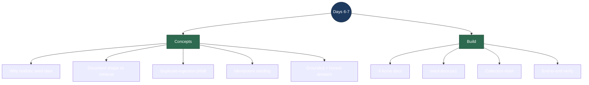

# Days 6–7 — Interview Revision: Consolidate (Realistic Seed Data + Reproducible Demo)

> **What the weekend delivered:** no new AI concept — this is the "make it real and make it repeatable" block. We turned one lonely policy file into a small but believable company (Acme Gadgets) with four documents of different *shapes*, and we added a one-command seed script that rebuilds the knowledge base from scratch, idempotently. The interview value here is not a new algorithm; it's **how you test a RAG system and with what data**, and spotting the **duplicate-ingestion** foot-gun before a reviewer does.
>
> **Run it:** with Qdrant + Ollama + the backend up, `./scripts/seed-docs.ps1` → then ask questions at http://localhost:5173.

---

## Topic map



---

## Concept Q&A

**Why bother writing a realistic fake company instead of testing with a couple of sentences?**
Retrieval quality is only meaningful against data that *looks like the real thing*. Two toy sentences can't show whether the system pulls the **right** document when several are plausible, whether citations point where you'd expect, or whether the model refuses when the answer genuinely isn't there. Four documents of different shapes — a prose policy, a Q&A FAQ, a step-by-step manual, a structured catalog — give the retriever real competition to resolve, and give the demo something a recruiter recognizes as a product.

**How does the *shape* of a document affect retrieval?**
Embeddings capture meaning, so a chunk's text matters more than its formatting — but structure still shows up. A tight Q&A entry ("Do you ship to PO boxes? … most PO boxes and APO/FPO addresses") embeds into a focused vector that scores high for that exact question. A long prose paragraph covering several topics produces a "blurrier" vector that matches a range of questions less sharply. Practically: question-shaped and single-topic chunks retrieve more precisely than sprawling multi-topic ones. This is the intuition behind chunking in the first place, seen on real content.

**What is the duplicate-ingestion pitfall, and why does it matter?**
Our `/ingest` endpoint tags every chunk with a fresh `Guid.NewGuid()`. That's correct for uploading *new* files, but it means ingesting the **same** file twice stores a second full copy — Qdrant has no idea it's a duplicate. The symptom is subtle and demo-breaking: top-5 retrieval starts returning the same chunk as `[1]` and `[2]`, and the citation list shows the same source twice. Being able to name this ("re-ingesting duplicates chunks because IDs aren't derived from content") is exactly the kind of operational awareness interviewers look for.

**How did you make seeding idempotent, and why not fix it in the backend?**
The seed script deletes the `supportpilot_docs` Qdrant collection before ingesting, so every run lands on exactly one copy of each document regardless of how many times you run it. I kept the fix in the *script* rather than the ingest endpoint on purpose: the endpoint's job is "add this uploaded file," and silently wiping the store on every upload would be wrong. The reproducible-demo concern belongs to the seeding tool. (The deeper fix — content-hash IDs so re-uploading a file upserts in place — is a legitimate backend improvement, noted for later.)

**You showed an answer that said "the context doesn't mention the TrailCam warranty specifically." Isn't that a miss?**
No — that's the system working. The catalog says *most* products carry a one-year warranty but doesn't call out the TrailCam by name. A grounded assistant should give what the documents support and be honest about the edge, rather than confidently inventing a TrailCam-specific clause. Grounded **and** appropriately hedged beats grounded-and-overconfident; it's the same guardrail from Day 4 showing maturity on real data.

---

## Build walkthrough

**`sample-docs/` — the Acme Gadgets corpus (4 files, different shapes)**
- `acme-support-policy.md` — prose policy: refunds, shipping, account, warranty, contact (from Day 4).
- `acme-shipping-faq.md` — **Q&A** format: delivery times, costs, international, tracking, PO boxes, lost/damaged.
- `acme-soundpods-pro-manual.md` — **step-by-step** product manual: pairing, touch controls, charging, troubleshooting, specs.
- `acme-product-catalog.md` — **structured** listing: products with SKUs (e.g. `AC-SP-200`) and prices. Doubles as setup for Day 8's order lookups.

**`scripts/seed-docs.ps1` — one command rebuilds the knowledge base**
- Resets the Qdrant `supportpilot_docs` collection first (idempotent; a 404 on delete is fine — nothing to clear).
- Walks `sample-docs/` for `.md/.txt/.pdf` and POSTs each to `/ingest` using PowerShell's `-Form` (multipart), the exact contract the `IFormFile` endpoint expects.
- Prints chunk/page counts per file and a total. `-KeepExisting` skips the reset to top up instead of rebuild.

**End-to-end verification (what "done" means here):**
- `pair the SoundPods Pro` → cites the **manual**; `how much do SoundPods Pro cost` → cites the **catalog**; `ship to a PO box` → cites the **FAQ**. Retrieval resolves to the right document among four competitors.
- `Who is the CEO of Acme Gadgets?` → `I don't know based on the available documents.` (guardrail intact).

**One-sentence flow to recite:** *Wrote a small multi-shape corpus for one fictional company, then made the demo reproducible with an idempotent seed script that resets the vector collection before re-ingesting — and verified retrieval lands on the correct document per question while still refusing the unanswerable one.*

---

## Talking points

- **"How did you test your RAG?"** — With a purpose-built corpus, not toy strings: four documents of deliberately different shapes for one fictional company, plus questions chosen so each *should* resolve to a specific document, plus known-unanswerable questions to prove the refusal path. (This sets up the formal eval suite on Day 11.)

- **I found a bug before a reviewer did.** Re-ingesting a file duplicates its chunks because IDs are random GUIDs, not content-derived — so retrieval and citations start doubling up. I contained it with an idempotent seed (reset-then-ingest) and noted the real fix (content-hash upsert) for later. Naming your own system's foot-guns is a strong signal.

- **Fix in the right layer.** The idempotency lives in the seeding *tool*, not the ingest endpoint — because "add this uploaded file" should not silently wipe the store. Knowing *where* a fix belongs is as important as the fix.

- **Grounded ≠ robotic.** On the TrailCam warranty question the model answered from the catalog *and* flagged what the docs don't specifically cover. That honest-hedge behavior is the guardrail paying off on realistic data.

- **Demo realism is a feature.** "Acme Gadgets" with SKUs, a product manual, and a shipping FAQ reads as a product a company would actually run — far more convincing in a portfolio than a lorem-ipsum chatbot.

---

## Reproduce-it cheatsheet

```bash
# Prereqs: Qdrant (Docker) + Ollama up, backend running on :5254.

# Rebuild the whole knowledge base from sample-docs/ (idempotent):
pwsh ./scripts/seed-docs.ps1

# Verify retrieval resolves to the right document per question:
curl -N "http://localhost:5254/chat?q=how+do+I+pair+the+SoundPods+Pro"   # -> manual
curl -N "http://localhost:5254/chat?q=how+much+do+SoundPods+Pro+cost"     # -> catalog
curl -N "http://localhost:5254/chat?q=do+you+ship+to+PO+boxes"            # -> FAQ

# Guardrail still holds on the unanswerable:
curl -N "http://localhost:5254/chat?q=who+is+the+CEO+of+Acme+Gadgets"     # -> "I don't know..."
```

**What to notice:** four documents now compete for every query, and retrieval consistently picks the right one; re-running the seed never inflates the chunk count (idempotent); and the refusal path survives contact with a fuller, more realistic corpus.
