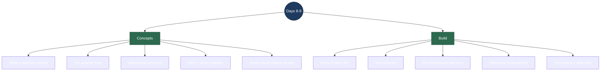

# Days 8–9 — Interview Revision: Function Calling (LLM Tool Use)

> **What Days 8–9 delivered:** the first *agentic* feature. The assistant can now answer questions that need **live data** it could never find in a document — "where is my order 1042?" — by deciding on its own to call a `get_order` function, running it against a mock Orders API, and answering with the result. This is **function calling / tool use**, the pattern behind almost every "AI agent." The hard part with a small local model isn't wiring the loop — it's making a 3B model call the tool *only when it should* and not leak malformed tool syntax into the answer.
>
> **Run it:** seed the docs (`./scripts/seed-docs.ps1`), then ask at http://localhost:5173 — mix a policy question with an order lookup and watch it do both.

---

## Topic map



---

## Concept Q&A

**What is function calling, end to end?**
You describe a function to the model as a JSON Schema (name, description, parameters). The model never runs code — when it decides the function is needed, it emits a structured request: "call `get_order` with `order_id=1042`." **Your** code executes that (here, a lookup in the mock Orders store), and you feed the result back into the conversation as a `tool` message. The model then writes its final answer using that result. Five stages: **describe → model decides → you execute → you inject the result → model answers.**

**Why does this need a loop (the "agentic" part)?**
Because a turn can end in one of two ways: the model answers, or the model asks for a tool. You can't know which in advance. So you loop: send the conversation, read the turn; if it asked for a tool, run it, append the result, and send again; if it answered, you're done. Each tool result can trigger *another* tool call, so the loop naturally handles multi-step tasks. I cap it at a few rounds and withhold the tool on the last round so the model is forced to answer instead of looping forever.

**How does the tool protocol look on Ollama specifically?**
The request carries a `tools` array (OpenAI-compatible function schemas). When the model calls one, the streamed response message has a `tool_calls` array — each with a function `name` and `arguments`. A quirk worth knowing: Ollama returns `arguments` as a **parsed JSON object**, not a stringified blob like the OpenAI API. The tool result goes back as a message with `role: "tool"` and the result as its `content`.

**How do RAG and tools coexist in one request?**
Two sources of truth. I still retrieve document chunks (RAG) and put them in the system prompt as CONTEXT, *and* I offer the `get_order` tool. The model answers policy/product questions from the context and calls the tool for live order data. A mixed question — "what's your refund policy, and where is order 1042?" — pulls the policy from the docs and the status from the tool in the same answer.

**What went wrong with a 3B model, and how did you fix it?** *(the real substance of these two days)*
Three distinct failure modes, three fixes:
1. **Over-eager calling** — the model called `get_order` even for "what's your refund policy," inventing an `order_id` like `"<ORDER_NUMBER>"`. Fix: **gate tool availability** — only *offer* the tool when the question looks order-related (keywords or a 3+ digit number). The model still decides whether to call it; I just don't hand a small model a loaded footgun on every question.
2. **Garbage arguments** — even when appropriate, it sometimes passed a placeholder id. Fix: **validate in the executor** — a non-numeric `order_id` returns a clean error the model recovers from, instead of a fake lookup.
3. **Tool-syntax leaking into the answer** — the model tried to "cite" a document by emitting it as a bogus function call (`{"name": "...support-policy.md", ...}`), which Ollama passed through as *text*. Prompting alone couldn't stop it. Fix: a **streaming filter** that strips `{...}` objects (and the `"}; "` junk before them) from answer text — support answers never contain braces, and bracketed `[1]` citations pass through untouched.

**Isn't tool-gating "cheating" — shouldn't the model decide?**
The model still decides *whether to call* the tool; gating only controls *whether it's offered*. It's a pragmatic guard for a small local model — the honest framing is "a larger, better tool-tuned model wouldn't need the gate." It's the same idea as tool routing in production systems, and being able to name the trade-off is the point.

---

## Build walkthrough

New folder `backend/SupportPilot.Api/Orders/` and additions to `Program.cs`:

**`Orders/OrdersStore.cs`** — the "live data." A small in-memory table of orders (status, carrier, tracking, items with catalog SKUs). In production this is an Orders microservice or DB; here it's deterministic so the whole flow is visible.

**`GET /orders/{id}`** — the mock API, directly curl-able (`curl localhost:5254/orders/1042`) so you can see the raw data the tool returns; 404 with `{error:"not_found"}` otherwise.

**The tool schema (`orderTools`)** — a JSON-Schema description of `get_order(order_id)`. The `description` field doubles as instruction ("only when the user provides a specific order number").

**`RunToolAwareChat`** — the agentic loop. Each round streams one model turn via `StreamOneRound`; if it returned tool calls, append the assistant turn + run each call + append the `tool` results, then loop; if not, the answer already streamed and we stop. Last round withholds tools (a stuck-loop safety net).

**`StreamOneRound`** — streams one turn: forwards answer tokens to the browser as SSE, and collects any `tool_calls`. Returns `(content, toolCalls)`; the `/chat` handler still owns the `[CITATIONS]`/`[DONE]` tail.

**`ExecuteTool`** — runs `get_order` defensively: parses `order_id` (tolerating string or number), rejects anything non-numeric with a clean error, returns the order JSON or a not-found error.

**The two guards:** `LooksOrderRelated(q)` gates whether the tool is offered; `StripToolCallLeak(...)` scrubs leaked tool-call JSON out of the streamed answer.

**One-sentence flow to recite:** *Retrieve docs for grounding, offer a `get_order` tool only when the question looks order-related, then loop: the model either answers from the context or asks for the tool — which I validate, execute against the mock Orders API, and feed back so the model answers with live data — while a streaming filter keeps any leaked tool syntax out of the reply.*

---

## Talking points

- **I can walk the full function-calling lifecycle** — schema → model decision → execution → result injection → final answer — and point to the exact code for each stage. That's the #1 thing an interviewer probes here.

- **The agentic loop is a loop for a reason.** A turn is either an answer or a tool request; you don't know which ahead of time, so you iterate until the model stops asking for tools, with a round cap for safety. Multi-step tool use falls out of the same loop for free.

- **Most of the work was making a small model behave.** Over-eager calls, hallucinated arguments, and tool-syntax leaking into prose are real small-model failure modes — I fixed each at the right layer (gate availability, validate arguments, filter output) rather than just praying at the prompt. That's the difference between a demo and something you'd ship.

- **RAG and tools are complementary, not competing.** Docs answer "what's the policy"; tools answer "where's *my* order." Combining them in one grounded, tool-aware turn is exactly what a real support assistant needs.

- **Honest about the gate.** The model decides whether to call the tool; I gate whether it's *offered* because a 3B model over-triggers. A bigger model wouldn't need it — and I can say so.

---

## Reproduce-it cheatsheet

```bash
# Prereqs: Qdrant + Ollama up, backend running, docs seeded (./scripts/seed-docs.ps1).

# The raw mock API the tool calls:
curl -s localhost:5254/orders/1042      # -> order JSON
curl -s localhost:5254/orders/9999      # -> {"error":"not_found",...}

# The assistant deciding when to use the tool:
curl -N "localhost:5254/chat?q=what+is+your+refund+policy"                 # docs only, no tool
curl -N "localhost:5254/chat?q=where+is+my+order+1042"                     # calls get_order
curl -N "localhost:5254/chat?q=refund+policy+and+where+is+order+1042"      # docs + tool
curl -N "localhost:5254/chat?q=where+is+order+9999"                        # tool -> not found
```

**What to notice:** the policy question never touches the tool (and streams clean, no JSON); the order question answers with live status/tracking/ETA; the mixed question does both; and a missing order produces "check your order number," not a hallucinated status.
