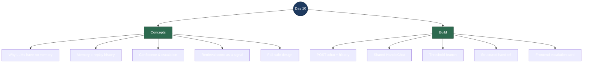

# Day 10 — Interview Revision: Memory + Escalation

> **What Day 10 delivered:** two things that turn a single-shot Q&A bot into something that behaves like a real support agent. **(1) Multi-turn memory** — the assistant now remembers the conversation, so a bare follow-up like "and what about to a PO box?" resolves against the previous turn instead of being meaningless. **(2) Escalation** — when retrieval confidence is too low to answer safely, it *stops guessing* and hands off to a human with a structured summary. The theme of the day is **honesty under uncertainty**: know what you don't know, and defer.
>
> **Run it:** ask a follow-up at http://localhost:5173 ("how long is international shipping?" then "what about to a PO box?"), then ask something the docs can't cover ("do you sell cars?") and watch it escalate.

---

## Topic map



---

## Concept Q&A

**Does the LLM "remember" the conversation?**
No — and this is the #1 thing to get right in an interview. An LLM is **stateless**: each call is independent, and the model only "knows" what's in the prompt for *that* call. There is no server-side memory inside the model. What we call "memory" is entirely on **our** side: we keep the conversation and **replay all prior turns into the prompt** on every request. Remove that replay and the model instantly forgets everything.

**So how did you implement memory?**
The frontend keeps the message list and sends the **whole conversation** on each request via `POST /chat { messages: [...] }`. The backend seeds the model prompt with the system message, then every prior user/assistant turn, then the new question. Retrieval still runs on just the **latest** user turn. I chose client-held history over a server session store because it keeps the backend stateless (no session lifecycle, no eviction) — which is how most real chat apps actually do it, and it's the honest, simplest design.

**What's the limitation of that, and where does it get fixed?**
Retrieval uses the *raw* latest turn, so a bare follow-up ("what about to a PO box?") retrieves poorly on its own — the word "shipping" isn't even in it. Memory lets the **model** interpret the follow-up correctly, but the **retrieval** for it is weak. Fixing retrieval for follow-ups is **Day 16 (query rewriting / conversation-aware retrieval)** — you rewrite "what about a PO box?" into a standalone query before embedding. Naming this trade-off is a strong interview signal.

**What is escalation and why does it matter?**
The most valuable guardrail in a support bot: **knowing when *not* to answer.** A model asked something outside its knowledge will happily hallucinate a confident-sounding wrong answer. Escalation detects "we can't answer this well" and, instead of guessing, produces a **structured hand-off** for a human — the question, the recent conversation, what we tried, and which team should take it. It's the difference between a demo and something a company will actually put in front of customers.

**How do you decide when to escalate? Why a retrieval score?**
I use the **top retrieved chunk's cosine similarity** as a confidence signal. If even the best-matching document scores below a threshold (0.5, calibrated against `nomic-embed-text`: on-topic questions score ~0.6+, off-topic ~0.4 and below), the knowledge base clearly can't answer, so I escalate **without even calling the model**. It's deterministic, cheap, and easy to explain. The alternative — giving the model an `escalate_to_human` tool and letting it self-assess — is more "agentic" but a 3B model is unreliable at judging its own confidence (we already saw it over-trigger `get_order`).

**Why not just keep saying "I don't know"?**
"I don't know" is a dead end for the customer. Escalation is the *actionable* version: it routes the question to a person and hands them everything they need to answer it. It's a **fail-safe** — when the system is unsure, it defers to a human rather than risking a wrong answer. That framing (safe failure, not silent failure) is exactly what interviewers want to hear about guardrails.

**Do order questions escalate?**
No. Escalation is gated to **non-order** questions, because orders are answered by the live `get_order` **tool**, not by the documents — their doc-retrieval score is naturally low and would false-trigger escalation. So the branch is: order-related → tool path (Day 8–9); otherwise, low doc score → escalate; otherwise → grounded RAG answer.

---

## Build walkthrough

All backend changes are in `Program.cs`; the frontend touches `api.js`, `App.jsx`, `App.css`.

**`POST /chat` + `GET /chat`** — two thin endpoints over one shared handler. GET (single question, easy to curl, backwards-compatible) wraps the question as a one-message conversation; POST carries the full `{ messages }` history. Both call `HandleChat`.

**`HandleChat`** — the shared pipeline: retrieve for the latest user turn → decide escalate-or-answer → ground the model in the context **plus the whole conversation** → stream. Extracting this from the old inline lambda is what let GET and POST share identical behaviour.

**The escalation branch** — `topScore = hits[0].Score`; if the question isn't order-related and `topScore < EscalationThreshold (0.5)`, call `EscalateAsync` and stop. No model call happens — if we don't trust retrieval, we don't let the model guess.

**`EscalateAsync`** — streams a short, honest hand-off message to the customer, then emits a **structured summary** as a sentinel event `[ESCALATE]<json>`: the reason, the customer question, the recent conversation, the retrieval evidence (top score + threshold + closest sources), and a `suggestedTeam`. That JSON is the view a human agent picks up from a queue.

**`SuggestTeam`** — a tiny keyword router (Billing / Orders & Shipping / Technical / General). A real system might use a classifier model (that's Day 18's structured-triage idea); a cheap heuristic is honest and explainable for now.

**Frontend** — `streamChat` now POSTs the history array and handles a new `[ESCALATE]` sentinel via an `onEscalate` callback. `App.jsx` builds the history from prior turns before each send and renders an `EscalationCard` (amber hand-off panel showing team, question, and why). The SSE contract is otherwise unchanged, so tokens/citations/`[DONE]` all work as before.

**One-sentence flow to recite:** *The frontend POSTs the whole conversation; the backend retrieves on the latest turn, and if even the best document match is below the confidence threshold it hands off to a human with a structured summary instead of guessing — otherwise it grounds the model in the context and the full history and streams the answer, so follow-ups resolve.*

---

## Talking points

- **An LLM is stateless — "memory" is replayed context.** I keep the conversation client-side and POST the whole history each turn; the model only knows what's in the prompt. Follow-ups resolve because the prior turns are right there in the prompt, not because the model "remembers."

- **I can name the limitation and where it's fixed.** Retrieval still runs on the raw follow-up, which retrieves poorly — that's the Day 16 query-rewriting problem. Memory fixes *interpretation*; query rewriting fixes *retrieval*. Two different fixes for two different halves.

- **Escalation is a fail-safe, not a dead end.** Low retrieval confidence → hand off to a human with everything they need, rather than hallucinate. That's the guardrail that makes a support bot deployable.

- **I used a deterministic, calibrated signal.** The top cosine score splits answerable (~0.6+) from unanswerable (~0.4) cleanly, so a 0.5 threshold is a cheap, explainable confidence gate — and I *measured* it rather than guessing.

- **I gated escalation correctly.** Order questions are answered by the live tool, not docs, so I exclude them from the retrieval-score escalation to avoid false triggers. Small detail, shows I traced the interaction between features.

---

## Reproduce-it cheatsheet

```bash
# Prereqs: Qdrant + Ollama up, backend running, docs seeded (./scripts/seed-docs.ps1).

# --- Escalation (non-order question the docs can't answer) ---
curl -N "localhost:5254/chat?q=what+is+the+capital+of+France"   # -> hand-off message + [ESCALATE]<json>
curl -N "localhost:5254/chat?q=do+you+sell+cars"                # -> escalates, suggestedTeam

# --- Still works (regressions) ---
curl -N "localhost:5254/chat?q=how+long+do+refunds+take"        # -> grounded answer, no escalation
curl -N "localhost:5254/chat?q=where+is+my+order+1042"          # -> get_order tool, live status

# --- Multi-turn memory (POST the conversation) ---
curl -N -X POST localhost:5254/chat -H "Content-Type: application/json" -d '{
  "messages": [
    {"role":"user","content":"How long does international shipping take?"},
    {"role":"assistant","content":"International orders typically take 7 to 14 business days."},
    {"role":"user","content":"And what about to a PO box?"}
  ]
}'   # -> answers about PO boxes even though "shipping" is never repeated
```

**What to notice:** the escalation case never calls the model (it streams a fixed hand-off + a structured summary a human would action); the regressions confirm RAG and the order tool are untouched; and the follow-up resolves purely because the prior turns are in the prompt — remove them and "what about a PO box?" is meaningless.
