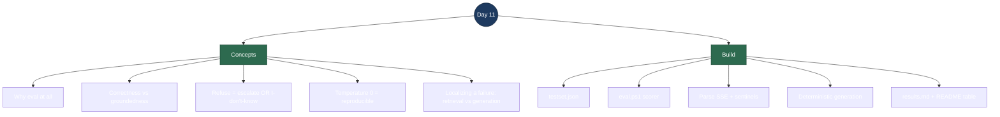

# Day 11 — Interview Revision: Guardrails + Evaluation (v1)

> **What Day 11 delivered:** the thing that turns "it worked when I tried it" into
> a *number*. A fixed **evaluation set** of 16 questions with known outcomes, an
> automated **scorer** that measures **correctness** and **groundedness**, and one
> supporting **guardrail** — pinning generation **temperature to 0** so answers are
> deterministic (and therefore the eval is reproducible). The theme of the day is
> **measurement**: you can't improve, or even trust, what you don't measure.
>
> **Run it:** `pwsh ./scripts/eval.ps1` → prints a pass/fail table and writes
> `docs/eval/results.md`. Latest: **15/16 correct, 16/16 grounded.**

---

## Topic map



---

## Concept Q&A

**Why build an eval at all — isn't manual testing enough?**
No. Manual spot-checks don't scale and don't catch regressions: change a prompt, a
chunk size, or a model and you have no idea what you broke. An eval is a **fixed set
of questions with known-correct outcomes** you can re-run on every change to get a
single number. It converts "seems fine" into "93.8% correct, and here's exactly
which case regressed." That repeatability is the whole point.

**What two things do you measure, and why both?**
**Correctness** — does the answer contain the known facts? **Groundedness** — did
the answer come from a *cited source* (for answerable questions), or did the system
*refuse* (for unanswerable ones)? They're different axes: an answer can be grounded
but wrong (it cited a source and still got the fact wrong), or it could be right by
luck without grounding. In a RAG support bot you care about both — a confident
ungrounded answer is exactly the hallucination you're trying to prevent.

**How do you score the questions the docs *can't* answer?**
The only correct behaviour there is to **not fabricate**. That has *two* acceptable
shapes: **escalate** to a human (Day 10's low-confidence hand-off), *or* give a
grounded **"I don't know based on the available documents."** Both refuse to guess,
so the scorer accepts either. (My first draft only accepted escalation and wrongly
failed two correct "I don't know" refusals — a reminder that the *eval itself* needs
reviewing: a bad rubric mismeasures a good system.)

**Why pin temperature to 0?**
Two reasons. (1) **Reproducibility** — at the default temperature (~0.8) generation
is random, so the same question can score differently run to run and the eval is
meaningless. Temperature 0 makes it deterministic: same input → same output → same
score. (2) **Faithfulness** — grounded factual QA wants the model to *extract* the
answer from the context, not to be "creative." Low temperature keeps it closer to
the retrieved text. It's a one-line change (`options: { temperature: 0 }` on the
Ollama request) but it's a real guardrail.

**How is correctness actually scored — isn't keyword matching crude?**
It is deliberately a **deterministic keyword check** for v1: each case lists the
facts a correct answer must contain (e.g. "5 to 7", "business days"), matched
case-insensitively. It's cheap, fast, and 100% explainable — no second model, no
non-determinism. Its limit is that it can't judge phrasing or partial correctness,
which is why the **LLM-as-judge** upgrade is explicitly scheduled for **Day 19**.
Knowing *why* you started with the crude version is the interview signal.

**Your one failing case — what did the eval actually teach you?**
That's the best part. *"How long do international orders take to arrive?"* was
refused — but the fact is in the **rank-1 retrieved chunk** (cosine 0.65), and the
*same* fact is answered correctly when the question says *"international shipping."*
So retrieval is perfect; the failure is in **generation** — the 3B model is brittle
to phrasing (lexical overlap between question and passage). The eval let me
**localize** the failure to a specific stage instead of guessing, and it points at
the right fixes: **query rewriting** (Day 16, to canonicalize the question) or a
**larger generation model** — *not* anything in the retrieval layer. I kept the
failing phrasing in the set on purpose; "fixing" it by rewording the test would be
gaming the eval and hiding a real weakness.

---

## Build walkthrough

**`docs/eval/testset.json`** — the test set as data, separate from the runner. 16
cases across all 4 seeded docs: 13 answerable (each with `keywords` + a `matchAll`
flag) and 3 `expect: "refuse"` (not in the docs). Keeping the cases as JSON means
growing the suite (Day 19 targets ~30) is just editing data.

**`scripts/eval.ps1`** — the runner. For each case it calls `GET /chat?q=…`,
parses the response, scores it, prints a table, and writes `docs/eval/results.md`.
Mirrors the `seed-docs.ps1` convention (PowerShell, no build step).

**Parsing the SSE stream** — the endpoint streams `data:` frames. The runner
concatenates answer tokens and watches the same sentinels the frontend does:
`[CITATIONS]<json>` (→ citation count, the groundedness signal), `[ESCALATE]`
(→ escalated), `[DONE]` (stop). A grounded "I don't know" is detected from the
answer text. So the eval exercises the *real* SSE contract, not a side channel.

**The scorer (`Test-Case`)** — `expect: "answer"` → the keywords must be present
**and** it must not have escalated; grounded = it cited ≥1 source. `expect:
"refuse"` → correct **and** grounded both mean it either escalated *or* said "I
don't know." A confident made-up answer to an unanswerable question fails both.

**The temperature guardrail** — `Program.cs` now sends `options: { temperature: 0 }`
on every Ollama chat request (`GenerationTemperature` const → `OllamaOptions`
record). This is what makes the score reproducible; without it the eval's numbers
would wander between runs.

**The report** — `results.md` is regenerated each run: a summary table
(correctness / groundedness) plus a per-question table. The summary table is copied
into the README so the numbers are visible without running anything.

**One-sentence flow to recite:** *A fixed set of questions with known answers runs
through the real `/chat` SSE endpoint; each answer is scored for correctness
(contains the known facts, or correctly refuses) and groundedness (cited a source,
or refused rather than guessed); temperature 0 makes the whole thing deterministic
so the number means something and regressions are visible.*

---

## Talking points

- **I measure, I don't vibe-check.** 16 fixed cases, two metrics (correctness +
  groundedness), one command, a written report. Re-runnable on every change so
  regressions surface as a dropped number, not a surprise in production.

- **Temperature 0 is a deliberate guardrail, not a default.** Grounded QA wants
  faithful extraction, and an eval needs determinism — a random temperature makes
  the score noise. One-line change, real consequence.

- **My rubric treats "I don't know" and "escalate" as both correct.** The property
  I actually care about for an unanswerable question is *not fabricating*, and that
  has two safe shapes. I even caught my *first rubric* mis-scoring good refusals —
  the eval needs reviewing too.

- **The eval localized a failure to a stage.** Retrieval put the fact at rank 1;
  the model still refused, and answered the same fact under different phrasing — so
  it's a generation/phrasing-sensitivity problem, fixed by query rewriting (Day 16)
  or a bigger model, not by touching retrieval.

- **I started crude on purpose.** Deterministic keyword scoring first (cheap,
  explainable); LLM-as-judge is scheduled for Day 19 once there's a baseline to
  compare against. Right tool for the phase.

---

## Reproduce-it cheatsheet

```bash
# Prereqs: Qdrant + Ollama up, backend running, docs seeded (./scripts/seed-docs.ps1).

# Run the whole suite -> table + docs/eval/results.md
pwsh ./scripts/eval.ps1

# Determinism check: run it twice, get the identical 15/16 & 16/16 (temperature 0).
pwsh ./scripts/eval.ps1 ; pwsh ./scripts/eval.ps1

# See the localized failure yourself: same fact, retrieval identical, phrasing differs.
curl -N "localhost:5254/chat?q=how+long+does+international+shipping+take"      # -> answers, cited
curl -N "localhost:5254/chat?q=how+long+do+international+orders+take+to+arrive" # -> "I don't know"
curl -s  "localhost:5254/search?q=how+long+do+international+orders+take+to+arrive" # -> fact is rank-1
```

**What to notice:** the score is identical across runs (temperature 0); the one
miss is a *generation* failure, not a retrieval one (the fact is the top hit); and
every "refuse" case declines to invent an answer — which is the guardrail the eval
exists to protect.
