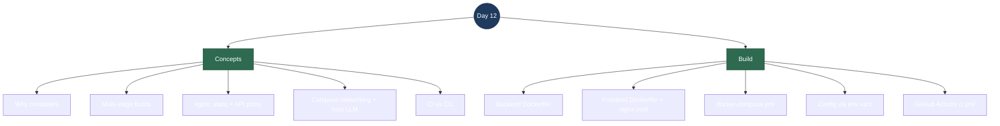

# Day 12 — Interview Revision: Containerize + CI

> **What Day 12 delivered:** the app now ships as **containers**, not "works on my
> machine." A multi-stage **Dockerfile** for the backend and one for the frontend
> (built React served by **nginx**, which also reverse-proxies the API), a
> **docker-compose** stack that brings the whole thing up with one command, and a
> **GitHub Actions CI** pipeline that builds all of it on every push. The theme is
> **reproducibility**: anyone can run the exact same stack, and CI proves it still
> builds.
>
> **Run it:** `docker compose up --build` → open http://localhost:8080.

---

## Topic map



---

## Concept Q&A

**Why containerize at all?**
To kill "works on my machine." A container bundles the app *and* its runtime (the
.NET runtime, or nginx) into one image that runs identically on my laptop, a
teammate's, CI, or the cloud. It also makes the whole system reproducible: one
`docker compose up` stands up Qdrant + backend + frontend wired together, instead
of a README with five manual steps that drift out of date.

**What is a multi-stage build and why use one?**
A Dockerfile with more than one `FROM`. The **build** stage uses the big SDK image
(the .NET SDK, or Node) to compile/publish; the **final** stage starts from a
small runtime image and copies in *only* the built output. The shipped image has
no compiler, no source, no `node_modules` — just what's needed to run. Smaller,
faster to pull, and a smaller attack surface. My backend image is `aspnet:10.0`
with just the published DLLs; the frontend image is `nginx:alpine` with just the
static `dist/`.

**Why does the frontend image run nginx, and what does it proxy?**
The React app is *static files* after `vite build` — there's no Node server in
production. nginx serves those files, and it also **reverse-proxies** `/chat`,
`/ingest`, `/search` to the backend container. That's the production version of
the Vite dev proxy: the browser only ever talks to one origin (nginx), so there's
**no CORS** and the frontend code — which calls relative `/chat` — doesn't change
between dev and prod. One important detail: `/chat` is **SSE**, so I set
`proxy_buffering off` in nginx, otherwise nginx would hold the whole response back
and the token-by-token streaming would break.

**How do the containers find each other — and where's the LLM?**
Compose puts all services on one network where each is reachable by its **service
name**: the backend talks to Qdrant at `http://qdrant:6333`, nginx proxies to
`http://backend:8080`. The interesting one is the LLM: **Ollama runs on the host**
(on the GPU), not in a container, so the backend reaches it at
`http://host.docker.internal:11434`. That split — stateless app containers, but
generation on the host GPU — is the whole reason a naive "deploy to the cloud"
doesn't just work (a cloud container can't see my laptop's Ollama). That's the
first decision in the Azure runbook.

**How does the backend get those URLs without code changes?**
ASP.NET Core config is layered: `appsettings.json` has the `localhost` defaults,
and **environment variables override** them. `Ollama:BaseUrl` in JSON becomes
`Ollama__BaseUrl` as an env var (double underscore = nesting). So compose just
sets `Qdrant__BaseUrl=http://qdrant:6333` and `Ollama__BaseUrl=http://host.docker.internal:11434`
and the same image runs locally, in compose, or in the cloud with different
values. No rebuild to reconfigure — that's twelve-factor config.

**What's the difference between CI and CD, and which did you build?**
**CI (continuous integration)** = on every push, automatically build and check the
code so breakage surfaces immediately. **CD (continuous deployment)** = automatically
ship that build to a live environment. I built **CI**: the GitHub Actions workflow
builds the backend (`dotnet build`), the frontend (`npm run build`), and **both
Docker images** on every push/PR to `main`. I deliberately stopped short of CD:
deploying needs a cloud account, billing, and a cloud-reachable LLM — real
decisions with cost attached — so that's a documented runbook (`docs/deploy/azure.md`)
gated on the human, not an automated step. Knowing *where* to draw that line is
the point.

---

## Build walkthrough

**`backend/SupportPilot.Api/Dockerfile`** — multi-stage. Copy just the `.csproj`
and `dotnet restore` first (so the restore layer caches and is skipped when only
source changes), then copy the rest and `dotnet publish -c Release`. The final
stage is `aspnet:10.0` with only `/app/publish`, listening on `8080`.

**`frontend/Dockerfile` + `nginx.conf`** — build stage runs `npm ci` +
`npm run build`; final stage is `nginx:alpine` serving `dist/`. `nginx.conf` does
two jobs: `try_files … /index.html` (SPA fallback) and a `location` block that
proxies the API paths to `http://backend:8080` with buffering off for SSE.

**`docker-compose.yml`** — three services. `qdrant` (with a named volume so
vectors survive restarts), `backend` (env vars for the two URLs, `extra_hosts` so
`host.docker.internal` resolves, host port kept at **5254** so `seed-docs.ps1` and
`eval.ps1` work unchanged), and `frontend` (published on **8080**). `depends_on`
sets start order.

**`.github/workflows/ci.yml`** — three jobs on push/PR to `main`: `backend`
(setup-dotnet 10 → restore → build Release), `frontend` (setup-node 22 → `npm ci`
→ build), and `docker` (buildx builds both images, `push: false`) to prove the
Dockerfiles themselves build. No secrets needed, so it runs for any fork.

**`docs/deploy/azure.md`** — the CD half as a runbook: push images to ACR, create
a Container Apps environment, deploy the three apps, and — front and center — the
"where does the LLM live?" decision (Azure OpenAI vs a cloud GPU vs a tunnel),
because that's what makes or breaks a real deploy.

**One-sentence flow to recite:** *Each piece builds into a small multi-stage image;
compose wires Qdrant + backend + nginx-frontend on one network with the LLM reached
on the host GPU; config comes from environment variables so the same images run
anywhere; and CI rebuilds all of it on every push while the actual cloud deploy
stays a deliberate, documented human step.*

---

## Talking points

- **Multi-stage images ship only the runtime.** SDK/Node build the app; the final
  image is `aspnet` or `nginx:alpine` with just the output — small and no build
  tooling inside.

- **nginx is the prod version of the dev proxy — and SSE forced a real detail.**
  One origin, no CORS, unchanged frontend code; `proxy_buffering off` so the
  token-by-token `/chat` stream isn't held back.

- **Config is environment variables, not rebuilds.** `Ollama__BaseUrl` /
  `Qdrant__BaseUrl` override the JSON defaults, so one image runs on my machine,
  in compose, and in the cloud with different values.

- **The LLM lives on the host GPU — that's the architectural catch.** App
  containers are stateless and portable; generation isn't, which is exactly why a
  cloud deploy needs a *decision* about where the model runs.

- **I built CI and drew the line before CD on purpose.** Building is free and
  automatable; deploying costs money and needs an account + a cloud LLM, so it's a
  runbook gated on the human. Knowing where automation should stop is a senior
  instinct.

---

## Reproduce-it cheatsheet

```bash
# Prereq: Ollama running on the host with both models pulled.
ollama serve

# Build + run the whole stack (qdrant + backend:5254 + frontend:8080).
docker compose up --build

# Seed, then use it via the nginx-served frontend.
pwsh ./scripts/seed-docs.ps1
curl -N "localhost:8080/chat?q=how+long+do+refunds+take"   # SSE through nginx -> backend -> Ollama

# Prove config is env-driven: the backend image is unchanged; only the URLs differ.
docker compose exec backend printenv | grep -E "Ollama__|Qdrant__"

# Tear down (add -v to also drop the Qdrant volume).
docker compose down
```

**What to notice:** the frontend you hit on `:8080` is nginx serving static files
*and* proxying `/chat` to the backend container; the backend reaches Qdrant by its
compose name and Ollama on the host; and nothing in the images is configured for
"localhost" — the URLs come entirely from environment variables.
