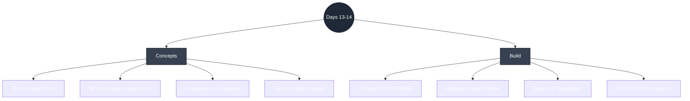
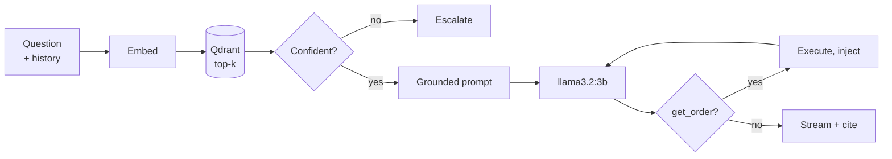

# Days 13–14 — Interview Revision: Make It Presentable

> **What Days 13–14 delivered:** no new features — this is the day the project
> stops being a codebase and starts being **evidence**. The README was rebuilt
> **recruiter-first** (pitch → demo GIF → architecture diagram → eval results →
> *then* the developer run-guide), a **mermaid diagram** of the query lifecycle
> was added, and the project's framing was corrected to match what was actually
> built: **no LLM framework, local Ollama, CI but not deployed**. The theme is
> **honest presentation**: every claim on the resume must survive someone opening
> `Program.cs`.
>
> **See it:** the repo root [README.md](../../README.md).

---

## Topic map



---

## Concept Q&A

**Q. Who is a project README actually for?**
Two audiences with opposite needs. A *developer* wants prerequisites and run
commands. A *hiring manager* wants to know, in about 40 seconds, whether you built
something real — and will never clone the repo. The original README opened with
`ollama pull` and `docker run`, which serves the audience that was never going to
decide anything. The fix is ordering, not content: pitch, demo, architecture,
evidence, *then* the run-guide that was already good.

**Q. What makes an architecture diagram worth including?**
It has to prove something a paragraph can't. A box-and-wire topology diagram
(browser → API → database) is in every tutorial repo and proves nothing about
whether you understand retrieval. The diagram here traces a **question's lifecycle**
and shows the three possible outcomes — grounded answer, tool call, human
escalation — because the *branching* is the part that isn't a tutorial.

**Q. When is simplifying a diagram dishonest?**
Abstraction is normal; a diagram that showed every branch would be unreadable. The
line is whether the simplification would **surprise** someone reading the code. The
`get_order` tool is only offered when a keyword check thinks the question is
order-related (`LooksOrderRelated`, `Program.cs:570`) — leaving that out of the
picture is fine, but leaving it *undocumented* would mean an interviewer discovers
it and concludes you were hiding it. So it's omitted from the diagram and stated in
one sentence of prose directly beneath it.

**Q. Why rewrite the resume bullets during a "presentation" day?**
Because the README and the resume are the same claim in two places, and one of them
was wrong. The plan said Semantic Kernel and Azure OpenAI; the build used neither.
The plan said "deployed to Azure Container Apps"; CI builds images and nothing is
deployed. A bullet that outruns the code is the worst possible failure mode — it
gets you into the room and then loses the room.

**Q. Isn't "no framework" a weakness?**
It costs two keywords a .NET recruiter's filter looks for. What it buys is that the
tool-calling loop — *JSON Schema → model emits a call → you execute it → you inject
the result → you re-prompt* — is something you implemented and can therefore explain
under questioning. A candidate who reached it through one framework method call
cannot. State it as a choice, not an omission.

---

## Build walkthrough

**1. README, reordered.** New top section is the pitch, the demo GIF, and a
"what you're seeing" list that maps one-to-one onto the GIF's three beats. The
existing prerequisites / Docker / local-dev sections were kept verbatim and moved
below — they were never the problem.

**2. The query-lifecycle diagram** (mermaid, so it renders on GitHub, diffs in git,
and can't rot the way a committed PNG does):



"Confident?" is the `EscalationThreshold = 0.5` cosine check at `Program.cs:309`.

**3. The demo GIF storyboard** — three beats, ~45s, ≤8MB, chosen to prove the three
things the resume claims:

| Beat | Question | Proves | Verified behaviour |
|---|---|---|---|
| 1 | "How long do refunds take?" | RAG: streaming + citation + retrieval score | answers, inline `[1]`, 5 cites, top 0.6337 |
| 2 | "Where is order 1042?" | Function calling against live data | tool fires, returns ship date + tracking `AE123456789US` |
| 3 | "Can I set up a monthly payment plan?" | Guardrail: escalation instead of a guess | escalates, `topScore 0.4373` < `0.5`, routed to **Billing** |

**Beat 3 needed care.** The obvious candidate — *"Who is the CEO of Acme Gadgets?"* —
does **not** escalate. Per `docs/eval/results.md` it merely refuses with "I don't
know", because the docs are saturated with "Acme Gadgets" and the top chunk scores
*above* 0.5. The only question in the whole eval set that reaches `EscalateAsync` is
*"What is the capital of France?"*, which reads as a gag rather than a product. So
beat 3 uses a question probed against `/search` for a top score below 0.50 that also
avoids tripping `LooksOrderRelated` (no *order / tracking / shipment / "where is my"
/ "my package"*, no 3-plus-digit number).

Ten candidates were probed; six cleared the threshold. The winner —
**"Can I set up a monthly payment plan?"** at **0.4373** — was chosen for two
reasons: it has the widest margin below 0.5 (so it won't flake on re-record), and
it contains "payment", which `SuggestTeam` routes to **Billing**. The near-miss
*"Can I pay in monthly installments?"* (0.4424) escalates too, but "pay" isn't a
router keyword, so it falls through to the generic "General Support" bucket — the
demo would show the fallback rather than the routing working.

**A known rough edge, deliberately left alone.** On beat 2 the answer is
tool-derived, yet five citations still render beneath it, all scoring *below* the
0.5 threshold — `Program.cs:363` emits the retrieved chunks unconditionally,
regardless of whether the answer used them. It isn't pure noise (the "My Orders"
phrasing does come from `acme-shipping-faq.md`), but citations would mean more if
they were filtered by confidence, or suppressed when a tool produced the answer.
That change would move the published groundedness score and require re-running the
eval, so it's a Week 3 refinement rather than a presentation-day edit.

**4. CLAUDE.md corrected.** The stack table now has a "planned" and an "as built"
column; the skills line drops Semantic Kernel and Azure OpenAI; the deployment
bullet says containerized + CI + *documented* deployment path.

---

## Talking points

- **"Walk me through the architecture."** Question → embed → top-k from Qdrant →
  confidence check → grounded prompt with the whole conversation → stream. If the
  question looks order-related the model also gets a `get_order` tool and may call
  it mid-stream; if retrieval confidence is below 0.5, it escalates instead.

- **"You gate function calling with a regex — doesn't that defeat the point?"** It
  restricts *when the tool is offered*, not what the model does with it; the
  decision, the call, and the result injection are all still the model's. It exists
  because a 3B model offered a tool every turn calls it on refund questions. With a
  larger model I'd drop the gate; a middle path is a cheap classifier instead of
  keywords.

- **"Why no Semantic Kernel?"** Cost and comprehension. Local Ollama made iteration
  free, and hand-writing the loop is why I can describe it. One NuGet dependency in
  the whole backend.

- **"Is it deployed?"** No, and the reason is specific: generation and embeddings
  run on a local GPU, and a cloud container can't reach it. Deploying means an
  Azure OpenAI endpoint (swap the client) or a rented GPU. Runbook for both is in
  `docs/deploy/azure.md`. CI builds all three images on every push.

- **"Your eval has a failure."** Yes, and it's diagnosed: the fact is in the rank-1
  chunk, so retrieval worked and generation didn't — the 3B model is phrasing-brittle.
  That's why query rewriting is Day 16 rather than a retrieval change.

---

## Reproduce-it cheatsheet

```bash
# 0. Bring the stack up (Ollama on the host, everything else in compose) and seed.
ollama serve
docker compose up -d --build
pwsh ./scripts/seed-docs.ps1          # 4 docs -> 8 chunks

# 1. Re-derive beat 3 yourself: a top score BELOW 0.50 means it will escalate.
#    Baseline for comparison: an in-scope question scores ~0.62.
curl "http://localhost:5254/search?q=Can%20I%20set%20up%20a%20monthly%20payment%20plan&k=1"   # 0.4373 -> escalates
curl "http://localhost:5254/search?q=Do%20you%20price%20match%20with%20other%20retailers&k=1" # 0.4760 -> escalates
curl "http://localhost:5254/search?q=My%20parcel%20arrived%20damaged&k=1"                     # 0.6648 -> answers

# 2. Confirm it escalates end-to-end (look for the [ESCALATE] frame + "Billing").
curl -N "http://localhost:5254/chat?q=Can+I+set+up+a+monthly+payment+plan%3F"

# 3. Record the three beats with ScreenToGif at http://localhost:8080; export
#    960px wide, 10 fps, trim the model's spin-up dead air, keep the token
#    stream. Target <8 MB. Save as docs/demo.gif.
```
